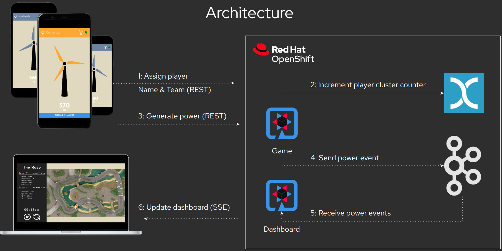

# Wind Turbine TSSC

This repository contains the Backstage Template used to create the Kubernetes resources needed to build/deploy the Wind Turbine game with Trusted Software Supply Chain.

The Wind Turbine app is an interactive game developed by [Andy Damevin](https://github.com/ia3andy) and curated by the [Red Hat Developer Advocates](https://developers.redhat.com/devnation/developer-advocates).
The client is a mobile phone and the backend has a dashboard at `/dashboard` to control and start the game.

Game's architecture:

* Quarkus backend and frontend
* Kafka
* Infinispan cache



## Repository Breakdown

* skeleton: app source code, it contains catalog-info, Dockerfile, Devfile, Gitlab CI  
* manifests: Kubernetes manifests source code for building and deploying the app: Argo CD App of Apps, Helm for build and deploy, Tekton, Tekton Chains and Argo CD

## How to use this template

1. Order the [Red Hat Trusted Application Pipeline](https://demo.redhat.com/catalog?search=RHTAP&item=babylon-catalog-prod%2Fenterprise.redhat-tap-demo.prod) Lab from demo.redhat.com
2. Install AMQ Streams Operator from OperatorHub
3. Replace in `template.yaml` the default hostname for `cluster_id`, Quay and Gitlab using your own cluster hostnames.
4. Register the template to your Developer Hub catalog. Create->Register new component-> add the URL from your fork or Gitlab copy e.g. https://github.com/WindTurbineInc/software-templates/blob/master/scaffolder-templates/gitlab/quinoa-wind-turbine/template.yaml
5. Use the template name Wind Turbine Software Supply Chain
6. Enable commit verification in Step 3

The setup will install the game in three envs:

* Dev: all the new commits land here, any new git push will trigger the build pipeline
* Pre-prod: When ready in dev, just tag your version in Gitlab and this will start the promote pipeline
* Prod: When ready in pre-prod, create a new release in Gitlab from your tag and this will start again the promote pipeline
  
Do a first commit do kick-off the first pipeline and then follow the flow.

A possible flow would be:

* Let the audience play with V1 in PROD (better generating qrcodes so they can scan the URL from mobile)
* Do a change in the code from DevSpaces or your local IDE, enable the shaking feature [here](https://github.com/WindTurbineInc/software-templates/blob/master/scaffolder-templates/gitlab/quinoa-wind-turbine/skeleton/src/main/webui/src/Config.js#L28) and let the audience play with V2 when pipeline ends.
* Promote the change as V2 with a V2 tag and then promote to prod with a release for V2.
* Enjoy!

If you use local IDE or the IDE provided in the VNC connected RHEL9 server , you can sign commit as follows (change hosts with your cluster):

```bash
git config --local --edit

[gitsign]
        fulcio = https://fulcio.apps.cluster-w4cfv.sandbox1117.opentlc.com
        issuer = https://keycloak-keycloak-system.apps.cluster-w4cfv.sandbox1117.opentlc.com/auth/realms/sigstore
        rekor = https://rekor.apps.cluster-w4cfv.sandbox1117.opentlc.com
        clientid = sigstore


git config --local commit.gpgsign true
git config --local tag.gpgsign true
git config --local gpg.x509.program gitsign
git config --local gpg.format x509

git commit -S -am "Signing from Linux"
```
